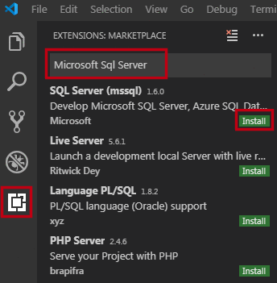
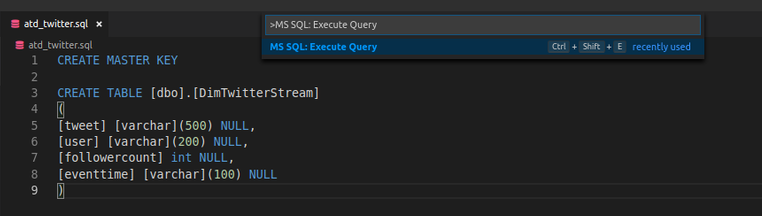
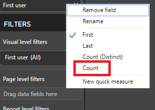
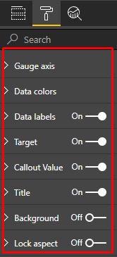
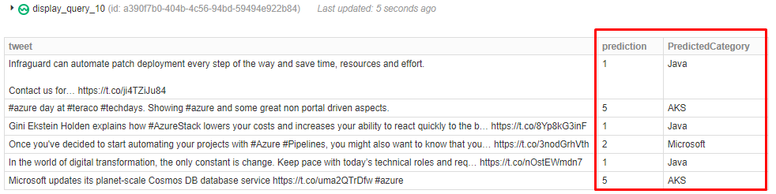
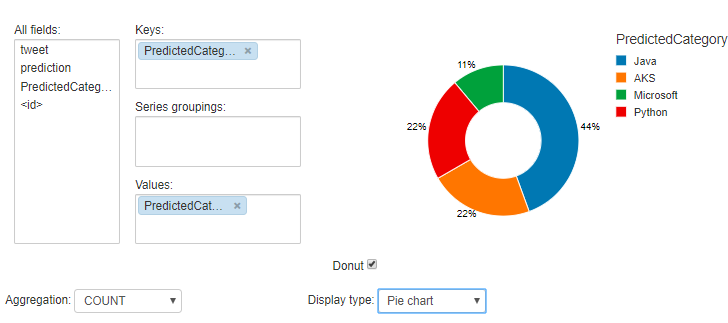

Table of contents
---
1. [Introduction](#intro)
2. [Dataset](#dataset)
3. [Demo Outline](#demo_outline)
4. [Stream analytics using Databrick](#stream_analytics_with_databricks)
    1. [Preparing the Databricks environment](#preparing__databricks_environment)
        1. [STEP 1: Create Azure Databricks](#step1)
        2. [STEP 2: Create Clusters](#step2)
        3. [STEP 3: Install libraries](#step3)
        4. [STEP 4: Create Databricks Notebooks](#step4)
    2. [Hot Path Data Processing with Databricks](#hot_path)
        1. [STEP 5: Get tweets from Event Hub for data analytics](#step5)
    3. [Archiving the tweets to SQL DW](#data_warehouse)
        1. [STEP 6: Create a Blob Store](#step6)
        2. [STEP 7: Create an Azure Data Warehouse](#step7)
        3. [STEP 8: Copy Stream Tweets to Data Warehouse](#step8)
    4. [Cold Path Data Processing with Databricks](#cold_path)
        1. [STEP 9: Load Data from SQL DW to Databricks](#step9)
        2. [STEP 10: Analyze the loaded data](#step10)
    5. [Visualization and Sentiment Analysis using PowerBI](#powerbi)
        1. [STEP 11: Connect Power BI to get data from SQL DW](#step11)
        2. [STEP 12: Visualization using Power BI](#step12)
        3. [STEP 13: Cognitive Service with Power BI](#step13)
    6. [Building ML Models and Real Time scoring in Databricks](#ml_model)
        1. [STEP 14: Model Training from the SQL DW using Databricks](#step14)
        2. [STEP 15: Scoring the Streaming Tweets from the Saved Model](#step15)
        3. [STEP 16: Clean up Resources](#step16)
    7. [Appendix](#appendix)
        1. [STEP 1: Creating an Event Hub](#appendix_step1)
        2. [STEP 2: Stream Tweets to Event Hub](#appendix_step2)


---

<a name="intro"></a>
## Introduction
Today you will be learning various key features of Azure Databricks. This tutorial aims at creating a scalable ingestion path that enables streaming of data in near real time. We will also discuss how Databricks can be connected to PowerBI for further analysis and reporting.

<a name="dataset"></a>
## Dataset
Let’s assume a company is interested in featuring the relevant data to its readers. The company uses social media analysis on topics that are relevant to readers by doing analysis of Twitter data. The company uses the tweets to train the defined set of topics and classifies the real time feeds relevant to different readers.

<a name="demo_outline"></a>
## Demo Outline
1. Hot path processing in Databricks

2. Cold path processing in Databricks

3. Visualization and Sentiment analysis using Power BI

4. Building ML models and Real Time scoring in Databricks

5. Q&A

<a name="stream_analytics_with_databricks"></a>
## Stream analytics using Databricks

<a name="preparing__databricks_environment"></a>
#### Preparing the Databricks environment
In this part, we will see how to create a Databricks workspace for data analytics. You will need to login into your Azure portal and complete the following steps

---
<a name="step1"></a>
#### STEP 1: Create Azure Databricks
---
1. In the Azure portal, select **Create a resource > Analytics > Azure Databricks**

    >

2. Under **Azure Databricks Service**, provide the values to create a Databricks workspace. Fill the pane with the below details and click on **Create**. The workspace creation takes few minutes.

    - **Workspace name**: ATDDemoDatabricks
    - **Subscription**: Select from the drop down list.
    - **Resource group**: Create a new resource group as **atd_techdays**
    - **Location**: Southeast Asia
    - **Pricing Tier**: Standard

    >

3. After the resource is created. Go to the resource page and launch the workspace.

    >

---
<a name="step2"></a>
#### STEP 2: Create Clusters
---
1. In the Azure Databricks opening page, click **New Cluster**.

    >

2. In the New Cluster page, provide foloowing values to create a cluster.
    * Cluster Name: SparkCluster
    * Cluster Mode: Standard
    * Select 5.3 as Databricks runtime version.
    * Select the Python version as 3.
    * Set the Driver type as ‘Same as worker’ and choose the worker type as ‘Standard_DS3_v2’.
    * Select max workers as 2, min workers as 1 and enable autoscaling.
    * Make sure you select the Terminate after 120 minutes of inactivity checkbox. Provide a duration (in minutes) to terminate the cluster, if the cluster is not being used.

    >

4. Select **Create Cluster**. Once the cluster is running, you can attach notebooks to the cluster and run Spark jobs.

---
<a name="step3"></a>
#### STEP 3: Install libraries
---
1. Select the **Workspace > Users** and click on your user. This will open a new side pane. **Right click** on it and choose **Create > Library** from the list.
    
    >

2. Create a new library in your Databricks workspace using the **PyPI**. In the new page, select the source as **PyPI**, enter the package name as **azure-eventhub** and click **Create**.

    >

3. Select the checkbox for your cluster and click on **Install**. This will install the library on that cluster.

    >

4. Follow same procedure to install **pubnub>=4.1.3**.
5. Create a new library in your Databricks workspace using the **Maven**. In the new page, select the source as **Maven**, enter the **Coordinates** as **azure-eventhubs-spark_2.11-2.3.1** and click **Create**.

    >

6. Select the checkbox for your cluster and click on **Install**. This will install the library on that cluster.

    >

---
<a name="step4"></a>
#### STEP 4: Create Databricks Notebooks
---
1. Click the **Azure Databricks** button in the sidebar and choose the option **New Notebook** from the **Common Tasks**.
2. In the **Create Notebook** dialog, enter Name: **TwitterRealTimeAnalytics** and select the notebook’s primary language as **Python**, then click **Create**.
    
    >

---
<br/><br/><br/>

<a name="hot_path"></a>
## Hot Path Data Processing with Databricks
In this flow, we will see how a data ingestion path can be built using Azure Databricks that enables the streaming of data in near-real-time. For real time streaming of tweets, we are using an API to feed data into an event hub.

---
<a name="step5"></a>
#### STEP 5: Get tweets from Event Hub for data analytics
---
1. **Read Tweets from the Event Hub**
    1. Open the **TwitterRealTimeAnalytics** notebook from the Workspace.
    
        >

    2. Use the prepared connection to event hub, replace **&lt;consumer_group&gt;** with the one you were given, and get the data stream.
        ```python
        from pyspark.sql.functions import *
        import json

        eventHubName = "atd-twitter-demo"
        consumerGroup = "<consumer_group>"
        connectionString = "Endpoint=sb://atd-demo.servicebus.windows.net/;SharedAccessKeyName=RootManageSharedAccessKey;SharedAccessKey=7cBCqsM2kVAgw7P9DENflkblfqzgUZbvAQW67tio5mw="
        connectionStringWithEventHubName = "%s;EntityPath=%s" % eventHubName
        eventPosition = {
          "offset": "@latest",
          "seqNo": -1,    
          "enqueuedTime": None,
          "isInclusive": False
        }

        ehConf = {
          "eventhubs.connectionString": connectionStringWithEventHubName,
          "eventhubs.consumerGroup": consumerGroup,
          "eventhubs.startingPosition": json.dumps(eventPosition)
        }

        eventhubs = spark.readStream.format("eventhubs").options(**ehConf).load()
        eventhubs = eventhubs.withColumn("body", col("body").cast("string"))
        ```

    3. Press **Shift+Enter** to run each cell. You will get an output as shown here.
    
        >

2. **Grouping data:**
The streaming data can also be aggregated to return a single value at every point. The spark streaming allows us to control the streaming data by applying either group by or window functions.
    
    1. Applying Group By functions.
        ```python
        streamingSelectGroupDF = eventhubs.select(get_json_object("body", "$.user").alias("user")).groupBy("user").count()
        display(streamingSelectGroupDF)
        ```
        >

    2. Window Functions
        ```python
        streamingSelectWindowDF = eventhubs.select(get_json_object("body","$.tweet").alias("tweet"),
                                               get_json_object("body","$.eventtime").alias("eventtime")).groupBy(window(col("eventtime").cast("Long").cast("timestamp"),"10 seconds")).count()
        display(streamingSelectWindowDF) 
        ```
        >

3. **Extract data from the JSON body and create View**
    1. The stream output sends the details as a json object. So, the next step is extracting each column from the json object.
        ```python
        streamingSelectDF = eventhubs.select(get_json_object("body","$.tweet").alias("tweet"),
                                               get_json_object("body","$.user").alias("user"),
                                               get_json_object("body","$.eventtime").cast("Long").alias("EventTime"),
                                               get_json_object("body","$.followercount").cast("Int").alias("followercount"))
        display(streamingSelectDF)
        ```
        >

    2. Create a temporary view
        ```python
        streamingSelectDF.createOrReplaceTempView("streamingDS")
        ```

    3. Streaming data can be stored in a temporary table in which normal SQL queries can be applied.
        ```python
        streamdf = spark.sql("select cast(hour(cast(EventTime as timestamp)) || minute(cast(EventTime as timestamp)) as Integer) as EventTime, count(tweet) as Tweets from streamingDS group by hour(cast(EventTime as timestamp))||minute(cast(EventTime as timestamp)) order by 1 asc")
        ```

4. **Visualizations**
    1. The easiest way to create a visualization in Databricks is to call display(&lt;dataframe-name&gt;)
        ```python
        display(streamdf)
        ```

    2. Click the bar chart icon to display a bar chart, click **Plot Options...**, add **EventTime** in keys and click **Apply**.
    
        >

    3. We can also visualize the data from the previous group by windows function to get a time series by selecting “Line” from the visualization dropdown box.
    
        >

5. **Dashboard**
    1. Navigate to the **View** menu, select **+ New Dashboard** and name the dashboard **My Dashboard**.
    
        >

    2. Now switch back to **Code** view.
    3. Choose the plots that needs to be displayed on the dashboard by choosing option over the right side of the cell.
    
        >

    4. Similarly, several charts can be made and visualized on the dashboard.
    
        >

---
<br/><br/><br/>

<a name="data_warehouse"></a>
## Archiving the tweets to SQL DW

* Data Warehouse is created to store the real time streaming tweets and do some batch analytics to it.
* The SQL DW connector offers efficient and scalable Structured Streaming write support for SQL DW that provides consistent user experience with batch writes and uses PolyBase for large data transfers between a Databricks cluster and SQL DW instance. You can access Azure SQL Data Warehouse (SQL DW) from Databricks using the SQL Data Warehouse connector (referred to as the SQL DW connector), a data source implementation for Apache Spark that uses Azure Blob Storage, and PolyBase in SQL DW to transfer large volumes of data efficiently between a Databricks cluster and a SQL DW instance.
* The next steps would be creating the Blob Storage and Data Warehouse that enables us to archive the streaming data.

---
<a name="step6"></a>
#### STEP 6: Create a Blob Store
---
1. In the Azure portal, go to **Create a resource > Storage**. and select **Storage Account**

    >

2. Name the Storage name and specify a subscription, resource group, and location.
    * **Name**: atdstore
    * **Account kind**: Storage(general purpose v1)
    * **Location**: Southeast Asia
    * **Resource group**: atd_techdays (which was created earlier)

    >

3. Keep the rest with the default values. Click  **Review + create** then **Create**. Wait for the deployment and then go to the resource.
4. Go to the **Blobs** under **Services** section and create a new container by clicking **+Container**.

    >
    ***
    >

5. Click **OK** after giving a name and access level as follows.
    * **Container Name**: outputresult
    * **Access Level**: Container

    >

6. Go to the **Access keys** under the **Settings** category and copy the **key1** value. Please ensure that you save the **blob storage name**, **container name**, **access key** for further use.

    >

---
<a name="step7"></a>
#### STEP 7: Create an Azure Data Warehouse
---
Data Warehouse is created to store the real time streaming tweets and do some batch analytics to it. Azure Data Warehouse is a “Database-as-a-Service” offering that enables you to run and scale highly available SQL Server databases in the cloud.

1. Go to Azure portal and go to **Create a resource > Databases** and select **SQL Data Warehouse**.

    >

2. Click **Server** to create and configure a new server for your new database. Fill out the **New server** form as given below and then click **Select**.
    * **Database name**: ATDTwitterDemo
    * **Resource group**: atd_techdays
    * **Server name**: atdtwitter&lt;your-name&gt;
    * **Server admin login**: jadmin
    * **Password**: Winter1$
    
    >

3. Click **Select Performance level** to specify the performance configuration for the data warehouse. Choose DW100 from Gen1. You can change the values by moving the slider and choose **Apply**.

    >

4. Click **Create** once you have filled up all the values.
5. Go to **All resources** to view the newly created Data Warehouse.

    >

6. Click on the newly created Azure Data Warehouse and copy and save the server name.

    >

7. Click on the newly created SQL SERVER and choose **firewalls and virtual networks** on the SQL server blade.

    >

8. Click **+Add Client IP** to add your IP to provide you access to the Data Warehouse. And Select **Save**.

    >
    ***
    >

9. To Access the database follow these steps:
    1. Download and Install Visual Studio Code from <a href="https://code.visualstudio.com/download" target="_blank">here</a>
    2. Open Visual Studio Code, click on Extensions tab, type **Microsoft Sql Server** and click on install for **SQL Server**.
        
        >

    3. Create new file by selecting **File>New File** and save the file as **atd_twitter.sql**.
    4. Go to **View>Command Palette** or press **Ctrl+Shift+P** to open the command palette.
    5. In command palette type **MS SQL:Connect** and select it. For first time it will download a library.

        >

    6. After the library is successfully downloaded, enter the same command as above again in cammand palette and follow these steps.
        - Select **Create Connection Profile**

            >

        - Give the Server name from **step 7.6** and press Enter

            >
        
        - Give Database name and press Enter

            >

        - Select **SQL Login**

            >

        - Give username: **jadmin** and press Enter

            >

        - Give password: **Winter1$** and press Enter. Select **yes** to save passsword.

            >

        - Give Profile name for the connection: **TwitterDemo** and press Enter

            >

    7. After successful connection enter the below statements in the file. Open the command palette(**Ctrl+Shift+P**) and select **MS SQL: Execute Query**.
    
        >As a prerequisite, the connector expects that a database master key already exists for the specified DW instance. If not, a key can be created using the CREATE MASTER KEY command.

        ```sql
        CREATE MASTER KEY

        CREATE TABLE [dbo].[DimTwitterStream] 
        ( 
        [tweet] [varchar](500) NULL,
        [user] [varchar](200) NULL,
        [followercount] int NULL,
        [eventtime] [varchar](100) NULL
        )
        ```

        >

10. At the end of this flow, make sure that you have saved the below details.
    * **Server name**
    * **Database name**
    * **Server username and password**


---
<a name="step8"></a>
#### STEP 8: Copy Stream Tweets to Data Warehouse
---
Open the **TwitterRealTimeAnalytics** Notebook and use the below code snippet to connect and load the data to SQL DW.

1. To access the  Blob Storage container using the Azure Blob Storage connector, the session configuration is being set for the particular runbook.
    ```python
    spark.conf.set("fs.azure.account.key.<storage-account>.blob.core.windows.net", "<storage-account-key>")
    ```

2. Replace the template with the storage account name and key.
    * **&lt;storage-account&gt;**: atdstore
    * **&lt;storage-account-key&gt;**: key1 from step 6.6
    
3. Write the contents to the Data Warehouse by specifying the temporary blob path and the checkpoint location.

    ```python
    tempDir = "wasbs://<container>@<storage-account>.blob.core.windows.net/tempDirs"

    dwDatabase = "<database>"
    dwServer = "<server>"
    dwUser = "<user>"
    dwPass = "<password>"
    dwJdbcPort = "1433"

    sqlDwUrlSmall = "jdbc:sqlserver://%s.database.windows.net:%s;database=%s;user=%s;password=%s" % (dwServer, dwJdbcPort, dwDatabase, dwUser, dwPass)

    streamingSelectDF.writeStream.format("com.databricks.spark.sqldw").option("url", sqlDwUrlSmall).option("dbtable", "DimTwitterStream").option("forward_spark_azure_storage_credentials","True").option("tempdir", tempDir).option("checkpointLocation", "/tmp_checkpoint_location").start()
    ```

4. Replace the snippet with the known details.
    - **&lt;container&gt;**: outputresult
    - **&lt;storage-account&gt;**: atdstore
    - **&lt;database&gt;**: ATDTwitterDemo
    - **&lt;server&gt;**: atdtwitter&lt;your-name&gt;
    - **&lt;user&gt;**: jadmin
    - **&lt;password&gt;**: Winter1$

5. In the Visual Studio Code from previous step, execute following query to verify the contents in the Data Warehouse.

    >Make sure you erase/comment previous queries.

    ```sql
    select * from [dbo].[DimTwitterStream]
    ```
    >

---
<br/><br/><br/>

<a name="cold_path"></a>
## Cold Path Data Processing with Databricks
After having the data to SQL DW. We can further analyze the data using the stored data using Databricks.

---
<a name="step9"></a>
#### STEP 9: Load Data from SQL DW to Databricks
---
1. Create another notebook **TwitterColdPartAnalytics.**
2. To access the Blob Storage container using the Azure Blob Storage connector, the session configuration is being set for the particular runbook.
    ```python
    spark.conf.set("fs.azure.account.key.<storage-account>.blob.core.windows.net","<storage-account-key>")
    ```
3. Replace the template with the storage account name and key.
    * **&lt;storage-account&gt;**: atdstore
    * **&lt;storage-account-key&gt;**: key1 from step 6.6

4. Use the given code to load the stored data from SQL DW.
    ```python
    tempDir = "wasbs://<container>@<storage-account>.blob.core.windows.net/tempDirs"

    dwDatabase = "<database>"
    dwServer = "<server>"
    dwUser = "<user>"
    dwPass = "<password>"
    dwJdbcPort = "1433"

    sqlDwUrlSmall = "jdbc:sqlserver://%s.database.windows.net:%s;database=%s;user=%s;password=%s" % (dwServer, dwJdbcPort, dwDatabase, dwUser, dwPass)

    storedDataDf = spark.read.format("com.databricks.spark.sqldw").option("url", sqlDwUrlSmall).option("tempDir", tempDir).option("forwardSparkAzureStorageCredentials", "true").option("query", "select * from DimTwitterStream").load()

    display(storedDataDf)
    ```
5. Replace the snippet with the known details and run the cell. This will result into following output.
    * **&lt;container&gt;**: outputresult
    * **&lt;storage-account&gt;**: atdstore
    * **&lt;database&gt;**: ATDTwitterDemo
    * **&lt;server&gt;**: atdtwitter&lt;your-name&gt;
    * **&lt;user&gt;**: jadmin
    * **&lt;password&gt;**: Winter1$

    >


---
<a name="step10"></a>
#### STEP 10: Analyze the loaded data 
---
From the loaded data, we can do the same analysis as we have done with real time data.

1. Count and sort user based on the number of tweets.
    ```python
    countTweetDf = storedDataDf.select("user").groupBy("user").count().sort(col("count").desc())
    display(countTweetDf)
    ```
    >

2. Visualize the number of tweets by hours.
    ```python
    from pyspark.sql.functions import *

    tweetTSDf = storedDataDf.withColumn("EventTimeInHour",date_trunc("HOUR", (col("EventTime").cast("Long").cast("timestamp")))).groupBy("EventTimeInHour").count().sort("EventTimeInHour")
    display(tweetTSDf)
    ```
    >

---
<br/><br/><br/>

<a name="powerbi"></a>
## Visualization and Sentiment Analysis using PowerBI
Power BI allows, you to explore and monitor data stored in your Azure SQL Datawarehouse directly. Connect it to the Azure SQL Data Warehouse using the below details.

---
<a name="step11"></a>
#### STEP 11: Connect Power BI to get data from SQL DW
---
1. To fetch the data from the Azure SQL Data Warehouse, download the Power BI desktop from the given link and after you connect it with the data source, you can publish the report to the Power BI service.

    >https://www.microsoft.com/en-us/download/details.aspx?id=45331

2. Click on Get data which will give you a drop down. You can select **SQL Server**.

    >

3. You will then see a screen to enter the SQL Server name and the Database name. This would be where the data is going to come from.
    * **Server**: atdtwitter&lt;your-name&gt;.database.windows.net
    * **Database**: ATDTwitterDemo
    
    >

4. Choose **Import** for the connectivity mode and click **OK**.

5. Now, select **Database** tab and give the username and password details as follows, and click **Connect**.
    * **Username**: jadmin
    * **Password**: Winter1$

    >

6. Select the database that you wanted to analyze. In our case choose **DimTwitterStream** and select **Load**.

    >


---
<a name="step12"></a>
#### STEP 12: Visualization using Power BI
---
1. **Visualization Type: Single**
    >These kinds of visualizations help to track a single value like the count of users in our example.

    1. Choose the visual
        * Under the visualizations pane, select the card icon.
        
        >

    2. Select the columns
        * Select the column **user**.

        >

    3. Do appropriate transformations
        * Right click on the *First user* located above **FILTERS** tab and choose the option count from the dropdown list.

        >

    4. Visualization
        * Plot that contains the total number of tweets gets displayed on the report.

        >

2. **Visualization Type: Comparison**
    >Displaying single value measure against the goal/target.

    1. Choose the visual
        * Under the visualizations pane, select the Gauze icon.
        
        >

    2. Select the columns
        * Drag the **followercount** field column and drag and drop to fields like Value, Minimum value, maximum value and Target value.

    3. Do appropriate transformations
        * Value = Average of followercount
        * Minimum Value = Min of followercount
        * Maximum Value = Max of followercount
        * Target Value = Max of followercount

        >

    4. Visualization
        * Gauage plot gets displayed on the report.

        >

    5. Formatting
        * You have many options for changing labels, text, color and more. Select the Formatting pane and explore more.

        >

3. **Visualization Type: Change over Time**
    >Visuals indicating the changes in measures across time

    >**Note:** The EventTime column should be first converted to datetime

    1. Convert EventTime to DateTime 
        - Select the **Edit Queries** from the toolbar.
        
            >

        - Choose **Add Column>Custom Column**

            >

        - Name the new column as EventDate and add the given formula to the box then click OK.            

            >

        - We will see a new datetime column added to the data.

            >

        - After making the changes, select File/Close & Apply.

            >

    2. Choose the visual
        - Under the visualizations pane, select the Line chart icon.

            >

    3. Select the columns
        - Drag the columns EventTime and sentiment across Axis and values respectively.

            >

    4. Visualization
        - Line chart gets displayed on the report.

            >

---
<a name="step13"></a>
#### STEP 13: Cognitive Service with Power BI
---
In this part, we use Power BI and Microsoft Cognitive Service to get the sentiment score for the tweets.

1. We first get our API key for the Microsoft Cognitive Service. 
Go to Azure portal to create a new **Text Analytics** service.

    >

2. Create a new Text Analytics service with the following information.

    - **Name**: atdtextanalytics
    - **Subscription**: Choose from the list
    - **Location**: Southeast Asia
    - **PricingTier**: F0(5K Transactions per 30 days)
    - **Resource group**: atd_techdays(which was created earlier)

    >

3. Go the the atdtextanalytics resource page. Choose **Overview** to get the service **Endpoint** and **API key**.

    >
    ***
    >

4. Go back to Power BI, choose **Edit Query**.

    >

5. Choose **New Source > Blank Query**. Rename the new query to **Sentiment** then click **Advanced Editor**.

    >
    ***
    >

6. Replace the given code to the editor. Change the API key to your key from **step 13.3**. Click **Done**.

    ```
    // Returns the sentiment score of the text, from 0.0 (least favorable) to 1.0 (most favorable) 

    (text) => let
        apikey = <your-api-key>, 
        endpoint = "https://southeastasia.api.cognitive.microsoft.com/text/analytics/v2.0/sentiment", 
        jsontext = Text.FromBinary(Json.FromValue(Text.Start(Text.Trim(text), 5000))), 
        jsonbody = "{ documents: [ { language: ""en"", id: ""0"", text: " & jsontext & " } ] }", 
        bytesbody = Text.ToBinary(jsonbody), 
        headers = [#"Ocp-Apim-Subscription-Key" = apikey], 
        bytesresp = Web.Contents(endpoint, [Headers=headers, Content=bytesbody]), 
        jsonresp = Json.Document(bytesresp),
        sentiment = jsonresp[documents]{0}[score] 
    in  
        sentiment 
    ```

7. You can test the new query by input to some string to the textbox and click **Invoke** button.

    >

8. Go back to **DimTwitterStream** table and click **Custom Column** under the **Add Column** tab.

    >

9. Name the column **SentimentScore** and add the given code to call the prepared Sentiment query. Click **OK**

    ```
    Sentiment([tweet])
    ```
    >

10. The result will be shown in the **SentimentScore** column.

    >

11. Click **File > Close & Apply** to apply the new column to the whole data. The apply process may take several minutes depend on the amount of data.

    >

---
<br/><br/><br/>


<a name="ml_model"></a>
## Building ML Models and Real Time scoring in Databricks
The Databricks allows to unify analytics across data engineering and data science by building ML models and making it convenient to export models and build full machine learning pipelines from Apache Spark MLlib.

---
<a name="step14"></a>
#### STEP 14: Model Training from the SQL DW using Databricks 
---
To classify the tweets, the prepared tweets and labels association are available. This predefined list is used to train the models. The model has been continuously trained using the data that was captured in the SQL DW.  

Create a new databricks notebook called **TwitterTopicPrediction** and use the below code snippets to build and train the model.

1. **Data Ingestion**
    - The data that is required to train the models were fetched by using the blob direct URL.

    ```python
    from pyspark.ml import Pipeline
    from pyspark.ml.evaluation import *
    from pyspark.ml.classification import LogisticRegression
    from pyspark.ml.feature import *
    from pyspark.ml.tuning import *
    ```
    ```python
    df = spark.read.csv("wasbs://tweetresults@jadatasciencediag402.blob.core.windows.net/", header=True, inferSchema=True)
    df1 = df.select("tweet", "Topic")
    display(df1)
    ```

    >

2. **Transformation**
    - The text format is very hard to read and train the model and hence the following transformations were used

        ```python
        labelIndexer = StringIndexer(inputCol="Topic", outputCol="label", handleInvalid='keep').fit(df1) 
        tokenizer = Tokenizer(inputCol="tweet", outputCol="words")
        hashingTF = HashingTF(inputCol="words", outputCol="features")
        categoryConverter = IndexToString(inputCol="prediction", outputCol="PredictedCategory", labels=labelIndexer.labels)
        ```

        1. LabelIndexer: The target labels were converted from text to numbers.

            ```python
            labelindexed_df = labelIndexer.transform(df1)
            display(labelindexed_df)
            ```
            >

        2. Tokenizer: The text is split into words
        
            ```python
            tokenized_df = tokenizer.transform(labelindexed_df)
            display(tokenized_df)
            ```
            >

        3. Hashing: The words are converted to numbers so that the system can understand.


            ```python
            hashed_df = hashingTF.transform(tokenized_df)
            display(hashed_df)
            ```
            >

3. **Model building**
    - Our problem is a supervised learning where the target or output value is known (TweetTopic). Logistic regression can be used to train the model.

        ```python
        lr = LogisticRegression(maxIter=20)
        pipeline = Pipeline(stages=[labelIndexer, tokenizer, hashingTF, lr, categoryConverter])
        model = pipeline.fit(df1)
        transformedResults = model.transform(df)
        display(transformedResults)
        ```
        >

4. **Model Evaluation**
    - Model Evaluation is an integral part of the model development process. It helps to find the best model that represents our data.
    
        ```python
        evaluator = MulticlassClassificationEvaluator(predictionCol="prediction", labelCol="label", metricName="accuracy")
        accuracy = evaluator.evaluate(transformedResults) 
        print("Test Error = %.2f" % (1.0 - accuracy))
        ```
        >

5. **Import data from DW**
    - The SQL DW connector offers efficient and scalable solution to pull records from the SQLDW.
        + **&lt;container&gt;**: outputresult
        + **&lt;storage-account&gt;**: atdstore
        + **&lt;database&gt;**: ATDTwitterDemo
        + **&lt;server&gt;**: atdtwitter&lt;your-name&gt;
        + **&lt;user&gt;**: jadmin
        + **&lt;password&gt;**: Winter1$
    
        ```python
        spark.conf.set("fs.azure.account.key.<storage-account>.blob.core.windows.net", "<storage-account-key>")

        tempDir = "wasbs://<container>@<storage-account>.blob.core.windows.net/tempDirs"

        dwDatabase = "<database>"
        dwServer = "<server>"
        dwUser = "<user>"
        dwPass = "<password>"
        dwJdbcPort = "1433"

        sqlDwUrlSmall = "jdbc:sqlserver://%s.database.windows.net:%s;database=%s;user=%s;password=%s" % (dwServer, dwJdbcPort, dwDatabase, dwUser, dwPass)

        storedDataDf = spark.read.format("com.databricks.spark.sqldw").option("url", sqlDwUrlSmall).option("tempDir", tempDir).option("forwardSparkAzureStorageCredentials", "true").option("query", "select * from DimTwitterStream").load()

        display(storedDataDf)
        ```

6. **Scoring on the DW data**

    ```python
    selectStoredDatadf = storedDataDf.select("tweet")
    scoredResults = model.transform(selectStoredDatadf)
    display(scoredResults) 
    ```
    >

7. **Saving the Best Model parameter Model**
    - The model parameters are saved in the mentioned path.

        ```python
        model.write().overwrite().save("dbfs:/tmp/ml_scala_model_export/")
        ```

---
<a name="step15"></a>
#### STEP 15: Scoring the Streaming Tweets from the Saved Model
---
Open the **TwitterRealTimeAnalytics** notebook and use the below code snippets to score the data from the saved model.

1. **Loading the Saved Model**
    ```python
    from pyspark.ml import PipelineModel
    pipelineModel = PipelineModel.read().load("dbfs:/tmp/ml_scala_model_export/")
    ```
    
2. **Feature Selection and Scoring**
    ```python
    sent = streamingSelectDF.select("tweet")
    results = pipelineModel.transform(sent)
    display(results)
    ```
    >

3. **Visualization**
    - We are using the pie chart to compare the counts of different predicted categories.

    >

---
<a name="step16"></a>
#### STEP 16: Clean up Resources 
---

1. Using the Azure portal, navigate to the Resource group you used throughout this hands-on lab by selecting Resource groups in the left menu.
2. Search for the name of your research group and select it from the list.
3. Select Delete in the command bar and confirm the deletion by re-typing the Resource group name then select Delete.
4. Pause the data warehouse

---
<br/><br/><br/>


<a name="appendix"></a>
## Appendix

---
<a name="appendix_step1"></a>
#### STEP 1: Creating an Event Hub
---
1. Go to Azure portal, select **Create a resource** search for **Event Hubs**.

    >

2. Create a new Event Hub Namespace using the following details and click **Create**.

    - **Name**: atdeventhub
    - **Pricing Tier**: Basic
    - **Subscription**: Select from the dropdown list
    - **Resource Group**: Use the existing resource group **atd_techdays**
    - **Location**: Southeast Asia
    - **Throughput Units**: 1

        >

3. Go to the Event Hubs resource page and click on **+ Event Hub**.

    >

4. Create new Event Hub with name **atd-twitter**.

    >

5. Go to Event Hubs > Shared access policies. Get your policy name and key as shown in the image and store for later.

    >

---
<a name="appendix_step2"></a>
#### STEP 2: Stream Tweets to Event Hub
---

>**pubnub>=4.1.3** library is required to be installed on the cluster. To install follow [STEP 3: Install libraries](#step3).

1. Import necessary modules

    ```python
    from pubnub.pnconfiguration import PNConfiguration
    from pubnub.pubnub import PubNub
    from pubnub.callbacks import SubscribeCallback
    from azure.eventhub import EventHubClient, EventData
    import json
    import logging
    ```

2. Initialize Event Hub Client and define a method to send data to event hub.

    ```python
    eventHubName = "<eventHubName>" # created in previous step
    connectionString "<connectionString>" # can be obtained from the Shared access policies tab in previos step
    connectionStringWithEventHubName = "%s;EntityPath=%s" % eventHubName

    eventHubClient = EventHubClient.from_connection_string(connectionString)
    sender = eventHubClient.add_sender()
    eventHubClient.run()

    # Send data to event hub
    def sendEvent(message):
      messageData = EventData(message.encode())
      sender.send(messageData)
      print("Sent event: " + message + "\n")
    ```

3. Pubnub Configuration and Initialization.

    ```python
    pnconfig = PNConfiguration()
    pnconfig.subscribe_key = "sub-c-78806dd4-42a6-11e4-aed8-02ee2ddab7fe"
    pubnub = PubNub(pnconfig)
    ```

4. Write a callback and add it as a listener to pubnub. This callback will send the tweet to event hub as soon as it arrives.

    ```python
    class TweetCallback(SubscribeCallback):
      def status(self, pubnub, status):
        logging.info(status.is_error())

      def message(self, pubnub, message):
        logging.info("message arrived")
        sendEvent(json.dumps(message.message))

      def presence(self, pubnub, presence):
        pass

    listener = TweetCallback()
    pubnub.add_listener(listener)
    ```

5. Finally Subscribe to **pubnub-twitter** channel to start listening for tweets.

    ```python
    pubnub.subscribe().channels("pubnub-twitter").execute()
    ```

6. To stop the streaming, execute following commands.

    ```python
    pubnub.unsubscribe().channels("pubnub-twitter").execute()
    eventHubClient.stop()
    ```
